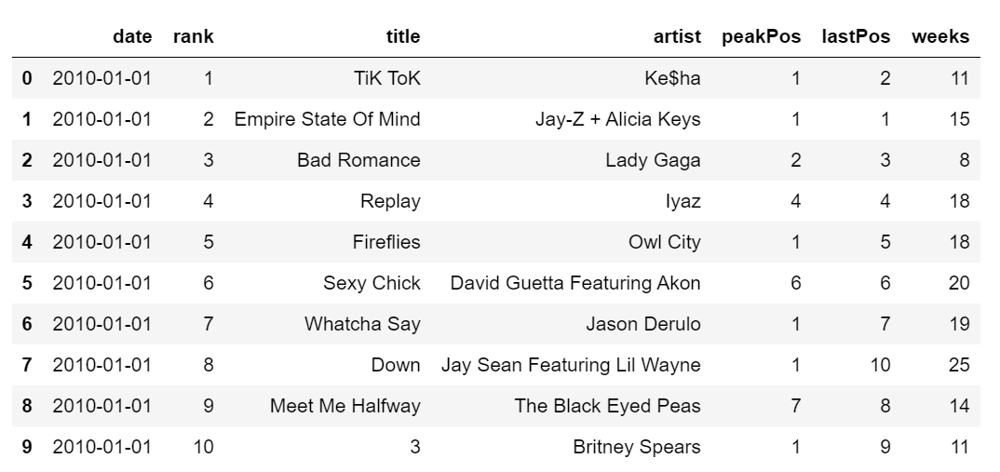
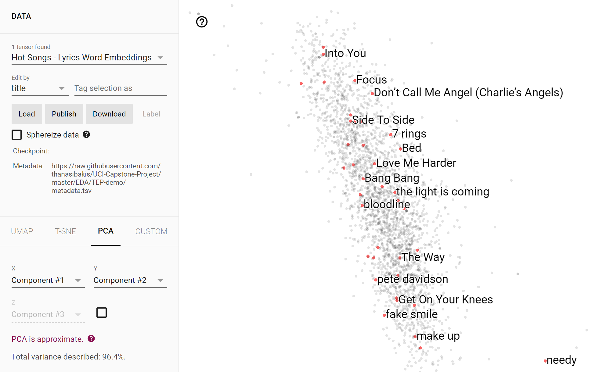

```{r, include=FALSE}
# Package svg must be able to reach inkscape to include the SVGs
options(tinytex.engine_args = '-shell-escape')
```

The repository for this project can be found at: https://github.com/thanasibakis/UCI-Capstone-Project.


# Introduction and Problem Statement

It has been shown in many studies that music has a significant impact on mood and emotions.^[Koelsch, Stefan. "Towards a neural basis of music-evoked emotions." Trends in cognitive sciences 14.3 (2010): 131-137.] Additionally, news has been cited as an influential factor in determining public sentiment.^[Kim, Hyo J., and Glen T. Cameron. "Emotions matter in crisis: The role of anger and sadness in the publics’ response to crisis news framing and corporate crisis response." Communication Research 38.6 (2011): 826-855.] People seem to have strong emotional responses to current events, which is especially visible in the public response to the current global pandemic. With this knowledge at hand, we hypothesized that there might be a correlation between news sentiment and the popularity of different types of songs (e.g. happy songs or sad songs) because of how both news and music have significant impacts on people’s emotions. In other words, we wanted to analyze how people’s emotional responses to current events would affect their music preferences and, in turn, song popularity. Our project aimed to analyze the possible association between public sentiment as reflected in Reddit news posts and the popularity of various songs as seen on online music charts. Through our project and exploration, we found that news sentiment did not have a significant impact on song popularity, contrary to our initial hypothesis.


# Related Work

A data analysis project of this scope naturally requires a multitude of features, as music and news can be complex and require significant amounts of information to accurately describe. Performing logistic regression with a large number of features can yield a phenomenon where the model’s coefficients are undefined because of singularities. Instead, we found that it can be beneficial to perform a lasso penalized logistic regression to reduce the number of features.^[Van de Geer, Sara A. "High-dimensional generalized linear models and the lasso." The Annals of Statistics 36.2 (2008): 614-645.] Another approach that can benefit high-dimensional datasets is principal component analysis (PCA), which is a fast and simple way to create a new feature set from which a subset of features can be chosen with close to the same amount of information provided.^[Partridge, Matthew, and Rafael A. Calvo. "Fast dimensionality reduction and simple PCA." Intelligent data analysis 2.3 (1998): 203-214.]


# Datasets

We obtained our data from four different sources: Reddit, Billboard, Spotify, and Genius. We used the APIs of these sources to obtain 10 years of data, spanning 01/01/2010 to 01/01/2020.

To begin with, we obtained our news data from Reddit, a social media discussion website where users can post content and their opinions. We obtained our news data exclusively from the [*r/news*](https://www.reddit.com/r/news/) subreddit, which is a subreddit where users post news articles. We wanted to focus on this subreddit specifically as we felt that it was a good representation of news that was relevant to the general public.

For the raw Reddit posts dataset, we ultimately collected 4,167,610 unique posts from between 01/01/2010 and 01/01/2020, each described by: `created_utc`, the timestamp on the post; `id`, Reddit’s unique identifier on the post (with respect to the subreddit); `num_comments`, the number of comments on the post; `permalink`, the URL to the post (in the event we needed to manually inspect it); `score`, the sum of the number of upvotes and negative number of downvotes that the post received; `title`, the title of the post, which would closely match the title of the news article posted; `url`, the URL of the news article posted; and `created`, which is equal to created_utc but in floating point format.

Visualizations of this data can be found in [*(4) Overall Technical Approach*](#approach).

Song popularity data was obtained via Billboard, a platform that creates chart rankings for music based on their popularity on streaming services, radio stations, and sales. Specifically, we downloaded the “Hot-100” chart for the first of every month in our ten-year timeframe.

For the raw Billboard charts dataset, we ultimately collected 12,100 unique rank positions over time, starting with rank 1 at month 01/01/2010 and ending with rank 100 at month 01/01/2020. Each position was described by: `rank`, the rank value described by this observation; `date`, the month described by this observation; `title`, the name of the song in the position; `artist`, the artist of the song; `image`, a URL to an image of the song’s album cover; `peakpos`, the highest rank value that the song has seen throughout its time on the charts; `lastpos`, the previous rank value of the song; `weeks`, the number of weeks that the song has been on the charts, including this position; and `isnew`, a boolean flag indicating if this this the song’s first appearance on the charts.



The Spotify API was one of two sources used to obtain descriptive information about the music listed in the Billboard charts. Specifically, we accessed the Spotify Web API, which provides an audio analysis endpoint to gain Spotify’s musical insight into each song. 

For the raw Spotify data, we ultimately collected descriptions of 3,025 unique songs, consisting of: `uri`, the unique Spotify identifier of the song; `duration_ms`, the duration of the song in milliseconds; `key`, the Spotify-estimated key of the song in pitch class notation; `mode`, the modality (major or minor) of the song; `tempo`, Spotify’s estimate of the number of the BPM (beats per minute) of the song; `time_signature`, the Spotify-estimated meter of the song; `acousticness`, Spotify’s confidence measure of whether the song is acoustic; `danceability`, Spotify’s measure of how suitable the song is for dancing (taking into consideration tempo, rhythm stability, beat strength, and overall regularity); `energy`, Spotify’s measure of the song’s perceptual intensity and activity (taking into consideration dynamic range, perceived loudness, timbre, onset rate, and general entropy); `instrumentalness`, the Spotify-estimated likelihood that the song contains no vocals (except “ooh” and “aah” sounds); `liveness`, the Spotify-estimated likelihood that the song was recorded with an audience; `loudness`, the average loudness of the song’s recording in decibels (dB); `speechiness`, Spotify’s estimate of how exclusively speech-like the song is (eg. spoken word); `valence`, Spotify’s measure of the song’s musical positiveness; and a small number of identification fields used by Spotify but otherwise irrelevant to our analysis. 


Lastly, the Genius API was our second source of music information, providing us with the lyrics of each song included in the Billboard charts we collected. 
For the raw Genius data, we ultimately collected information about 2,967^[A careful reader may note that this number is different from the number of observations in the Spotify dataset. This can be attributed to a number of points, including the song’s inability to be searched on Spotify or Genius, or the inability to link a song’s identities in the Billboard, Spotify, and Genius datasets. This is most frequently due to a song having alternate title entries in each source, eg. due to featured artists being listed in the title field instead of the artist field, or vice versa.] unique songs, consisting of: `title`, the title of the song; and `lyrics`, the lyrics of the song. 


# Overall Technical Approach {#approach}


## Data Scraping

Seeing how we had four different APIs to pull from, we needed a flexible and automatic tool that would allow us to fetch only the data we wanted at any given time. We wrote a Python tool that read boolean flags to determine which APIs to access, and automated the insertion process to our database. Furthermore, there was a setting to change the length of time over which the data would span, so we were able to start with just six months’ worth of data to verify the correctness of the tool, before moving on to ultimately ten years of data. This tool was run on a cloud virtual machine to ensure uptime, optimize processing efficiency, and not tie up our local computer resources. 

We opted to collect as many fields as possible to store to the database, as we wanted to ensure that the scraping would not have to be rerun in the future should we have decided to create new features. Furthermore, to facilitate future data analysis, we added Spotify’s `uri` feature to the Billboard and Genius datasets by searching each song’s title and artist name via the Spotify API. 


## Data Management and Preprocessing

In order to host our data, we decided to invest in the services of Google Cloud Platform, specifically its PostgreSQL server and virtual machine capabilities. After performing our initial web scraping, we decided to store our raw data in four data tables, one for each data source.

For our Spotify data, we chose to use all of the features from the raw data listed earlier (with the obvious exception of its `uri`) as features in our model, as we thought that a song’s musical features, such as `tempo` and `danceability`, would help determine the overall sentiment of the song. We stored this subset of the Spotify features in a new audio features table, to isolate them from the irrelevant identification fields discussed earlier.

For our Billboard data, we chose to preserve the `date` (which we renamed more appropriately to `month`), `rank`, `lastpos`, `peakpos`, `uri`, and `weeks` features listed earlier. We chose to eliminate the `isnew` feature, it being redundant and easily derived from `lastpos.` (If the `lastpos` feature had a value of `0`, this indicated that the song was new to the chart.) We also chose to exclude the `title` and `artist` features, instead basing the song sentiments on their `lyrics`, which we obtained from Genius. We stored this subset of the Billboard features in a new chart features table.

In regards to our Reddit post data and song lyrics, we wanted to analyze the sentiments of these different sources to truly understand the emotions related to news articles and different songs.

For our Reddit data, we chose to analyze the sentiments of the news post titles. It is important to notice how the music charts were measured each month, but a large number of posts were observed for each month. As a result, we aggregated all of the post titles for a month of data via concatenation and performed our analysis on this aggregation instead, looking at the overall sentiment of the posts for each month.

Now, such aggregation was not necessary for the lyrics data. We chose to consider our atomic unit of data to be each unique chart position over time (eg. rank 1 at month 01/2010), such that the song in each position would be analyzed with the news that occurred during the month that the position belongs to. Seeing how each chart position over time contains exactly one song, there would be no need to perform any aggregation of song information.

We initially performed a score-based sentiment analysis on our lyrics and news titles, resulting in four different sentiment measures for each song and month of news. While these scores have the benefit of being decently interpretable, we also wanted to incorporate a higher level of detail when capturing text information. As such, we additionally turned to the method of word embeddings. Both methods of text analysis are described below.


## Sentiment Analysis

We performed our sentiment analysis in Python using the VADER library, a lexicon and rule-based sentiment analysis tool, and the NLTK library, a natural language processing tool. Details and references about these tools are listed in [*(5) Software*](#software).

To begin with, we used NLTK to tokenize the text, splitting up long chunks of text into words and entities. We then removed stopwords from our list of tokenized words, as these words are not considered helpful in determining the overall context of a string of text. After removing stopwords, we proceeded to lemmatize our list of words. Lemmatization converts each word to its base or root form, allowing different forms of the same word to be grouped together.

Following this initial text processing with NLTK, we then leveraged VADER to analyze our list of lemmatized words. VADER provides four different sentiment scores for the text as a whole: positive, negative, neutral, and compound scores. The positive, negative, and neutral scores, which together sum to 1, refer to the proportions of the text whose sentiment could be classified in each category. The compound score is computed by summing up VADER’s valence scores of each word in the text and is then normalized to be between -1 and 1. We used these four sentiment scores as features in our model to reflect the overall sentiments of the lyrics and news posts.


## Word Embeddings

In order to get a high-dimensional representation of the textual data (lyrics and post titles), we made use of the technique of word embeddings, which vectorizes each individual word of the text into a fixed-dimensional space for comparison between words. In particular, we used a Word2vec model, which is a shallow neural network that is trained to map words to such vectors. Rather than train our own model, we loaded a pre-trained model from Google, trained on Google News data and able to recognize 3 million words and phrases. This model outputted vectors in 300-dimensional space, which we felt would be more than large enough to be useful as features for extracting sentiment. The details and reference of this tool are listed in [*(5) Software*](#software).

Now, we needed to aggregate the word vectors in order to come up with a single representation of the text as a whole. It has been shown that taking the element-wise minimums and maximums of the vectors is an effective approach^[De Boom, Cedric, et al. "Representation learning for very short texts using weighted word embedding aggregation." Pattern Recognition Letters 80 (2016): 150-156.], and thus we obtained two 300-length vectors for each song’s lyrics and each month of news. The 600 elements of these vectors, as well as the four sentiment scores discussed earlier, were stored in two new tables: one for the lyrics of each song (indexed by `uri`) and one for the news in each month (indexed by `month`).

In summary, we extracted our desired features from our four raw data tables into four new feature tables. From here, we wrote a SQL script and joined all of our music feature tables together into one master music table, indexed by the `uri` of the song. We then merged our master music table with our news features table, ultimately creating one final dataset with 1,228 features and 9,814 observations.


## Exploratory Data Analysis

In order to get a sense of the data we would model, we conducted some exploratory data analysis in R.

We first wanted to look for any trends in the positive and negative sentiments of the music and news data. We plotted the positive and negative sentiment scores of the news data over our ten-year range. We noticed that in general, news sentiment was more negative than it was positive during this time period. We also noticed that news negativity seemed to peak in April 2013.

\begin{figure}
  \centering
  \includesvg[width = \linewidth]{images/news_plot}
  \caption{A line plot of the positive and negative sentiment scores of news.}
\end{figure}

We also plotted the sentiments of the music data to see how those sentiments changed over time. Since each month of music data had 100 different positive and negative sentiment scores (corresponding to the 100 different songs on the chart for that month), we aggregated the scores for each month by averaging across all songs. After plotting these scores over the ten-year range, we noticed that the overall music sentiment was consistently more positive than it was negative. Interestingly enough, we noticed that right after April 2013, there seemed to be a large decrease in negative song sentiment and a large increase in positive song sentiment. We hypothesized that this shift towards more positive music could have been a result of the recent increase in the negativity of the news, seen earlier.

\begin{figure}
  \centering
  \includesvg[width = \linewidth]{images/music_plot}
  \caption{A line plot of the positive and negative sentiment scores of music charts.}
\end{figure}

In order to visualize the word embedding vectors for our music data, we used the Tensorflow Embedding Projector.^[We have set up a pre-loaded projector of our music data for the reader to see for themselves: http://projector.tensorflow.org/?config=https://raw.githubusercontent.com/thanasibakis/UCI-Capstone-Project/master/EDA/TEP-demo/template_projector_config.json] This tool performs PCA on the vectors to reduce them to three significant components for visualization purposes. Each vector is plotted on this new three-dimensional space and labeled using the title and artist of the song it belongs to.



The tool also allows the user to search for songs by a given artist and highlight matching search results on the plot, which enables the user to interpret for themselves the distances between the embeddings. 

Notice that we did not do such visualization for the news data, as the labels of “month” would be far less interpretable than the song labels. It is easier for the user to infer the sentiment “closeness” of two songs they are familiar with, but more difficult to infer such closeness of two arbitrary months in time.


## Data Modeling

Our interest is predicting whether or not a song’s ranking goes up or down, after considering the effects of the prior month’s news and the song’s musical characteristics. As a result, we modeled our features against the binary indicator variable, `I(rank < lastpos)`, using standard classification models.

Our first model ("Model 1") was a logistic regression performed on a PCA-transformed version of our dataset. We first separated the news-related and music-related features, performed PCA on each of those groups, and extracted the first thirty principal components from each group. We then created 900 interaction terms from this feature set, by multiplying each music component with each news component. The results of Model 1 are discussed in [*(6) Experiments and Evaluation*](#evaluation).

Our second model ("Model 2") was a lasso logistic regression performed on a different PCA-transformed version of our dataset. We conducted PCA on the entire set of music and news features together, thus defining our 1,228 interaction terms to be linear combinations of the various features. The lasso regression then decided which of the terms to preserve, with the tuning parameter automatically chosen by the glmnet package. The results of Model 2 are discussed in [*(6) Experiments and Evaluation*](#evaluation). Details and the reference to this package are listed in [*(5) Software*](#software).

Our final model ("Model 3") was a random forest model performed on the dataset unaltered, using the randomForest package. The goal with this model was to see if the interactions between the features needed to be implemented in a non-parametric way. The results of Model 3 are discussed in [*(6) Experiments and Evaluation*](#evaluation). Details and the reference to this package are listed in [*(5) Software*](#software).


# Software {#software}

The self-written software developed for this project is as follows, listed in order of use:

| Name | Description |
|------|-------------|
| `data_fetching.py` | A web scraping tool for retrieving raw data from the four APIs and sending it to our database |
| `text_analysis.py` | A feature engineering tool for creating the four sentiment scores and two word embedding vectors from the lyrics and post titles |
| `create_features_table.sql` | A script for transforming the raw data tables into a data table suitable for analysis |
| `EDA_sentiment.scores.R` | An exploratory data analysis (EDA) script for visualizing the sentiment scores of music and news over time |
| `EDA_word_embeddings.R` | An EDA script for exporting the music data for use in the Tensorflow Embeddings Projector |
| `model1.Rmd` | A data analysis notebook for fitting Model 1 |
| `model2.Rmd` | A data analysis notebook for fitting Model 2 |
| `model3.Rmd` | A data analysis notebook for fitting Model 3 |

The third-party software and libraries we utilized are as follows, in approximate order of use:

| Name | Description |
|------|-------------|
| PSAW^[Marx, David (2020). PSAW. GitHub Repository. https://github.com/dmarx/psaw] | A minimalist wrapper for searching public Reddit submissions via the pushshift.io API |
| Spotipy^[Lamere, Paul (2020). Spotipy. GitHub Repository. https://github.com/plamere/spotipy] | A lightweight Python library for the Spotify Web API |
| LyricsGenius^[Miller, John W (2020). LyricsGenius. GitHub Repository. https://github.com/johnwmillr/LyricsGenius] | A Python client for the Genius.com API |
| Billboard.py^[Guo, Allen (2020). Billboard.py. GitHub Repository. https://github.com/guoguo12/billboard-charts] | A Python API for accessing music charts from Billboard.com |
| GCP Compute Engine^[https://cloud.google.com/compute] | Computing infrastructure in predefined or custom machine sizes to accelerate cloud transformation |
| GCP Cloud SQL^[https://cloud.google.com/sql] | Fully managed relational database service for MySQL, PostgreSQL, and SQL Server |
| NLTK^[Bird, Steven, Edward Loper and Ewan Klein (2009), Natural Language Processing with Python. O’Reilly Media Inc.] | A leading platform for building Python programs to work with human language data  |
| nltk.sentiment.vader^[Hutto, C.J. & Gilbert, E.E. (2014). VADER: A Parsimonious Rule-based Model for Sentiment Analysis of Social Media Text. Eighth International Conference on Weblogs and Social Media (ICWSM-14). Ann Arbor, MI, June 2014.] | A Parsimonious Rule-based Model for Sentiment Analysis of Social Media Text |
| GoogleNews-vectors-negative300^[https://code.google.com/archive/p/word2vec/] | A pre-trained Word2vec model containing 300-dimensional vectors for 3 million words and phrases |
| Gensim^[Radim Rehurek & Petr Sojka (2010). Software Framework for Topic Modelling with Large Corpora. In Proceedings of the LREC 2010 Workshop on New Challenges for NLP Frameworks (pp. 45–50). ELRA.] | A Python library for topic modelling, document indexing and similarity retrieval with large corpora |
| TensorFlow Embedding Projector^[https://www.tensorflow.org/tutorials/text/word_embeddings] | A tool for graphically representing high dimensional embeddings |
| glmnet^[Friedman J, Hastie T, Tibshirani R (2010). “Regularization Paths for Generalized Linear Models via Coordinate Descent.” Journal of Statistical Software, 33(1), 1–22. http://www.jstatsoft.org/v33/i01/.] | Extremely efficient procedures for fitting the entire lasso or elastic-net regularization path for regression |
| randomForest^[Breiman, L. (2001). Random forests. Machine learning, 45(1), 5-32.] | Classification and regression based on a forest of trees using random inputs, based on Breiman (2001) |
| plotROC^[Michael C. Sachs (2017). plotROC: A Tool for Plotting ROC Curves. Journal of Statistical Software, Code Snippets, 79(2), 1-19.<doi:10.18637/jss.v079.c02>] | A tool for plotting ROC curves |


# Experiments and Evaluation {#evaluation}

Each model was fit and evaluated with a random train-test split of 50-50%. The model evaluation metrics used were accuracy (with a threshold of 0.5) and AUC. Accuracy is calculated as the number of correct predictions made divided by the total number of predictions made. AUC is defined as the area under the ROC curve, which plots the true positive rate vs. the false positive rate for a set of varied thresholds. 

Model 1 was found to have an accuracy of 54.55% and an AUC of 0.5185. Considering how the true response variable distribution was approximately 60% false and 40% true, we noted that this model is outperformed by one that simply predicts false for every observation. Furthermore, we observed the ROC curve of this model to resemble more of a straight line, as seen below:

\begin{figure}
  \centering
  \includesvg[width = \linewidth]{images/model1_roc}
  \caption{The ROC curve for model 1.}
\end{figure}

Model 2 showed significant improvements, with an accuracy of 64.42% and an AUC of 0.6812. This model performed better than one that simply predicts false for every observation. We also observed that the ROC curve of this model was more curved than that of the previous model, as seen below:

\begin{figure}
  \centering
  \includesvg[width = \linewidth]{images/model2_roc}
  \caption{The ROC curve for model 2.}
\end{figure}

Model 3 did not show the same significant improvements, with an accuracy of 55.37%. Since it only produces a hard classification without probabilities, an AUC score and ROC curve are not available.

# Notebook Description

Each model was implemented in its own RMarkdown notebook. The basic workflow was as follows: download the dataset from the database, and save it locally; perform any feature transformations, and save those locally; generate the string representation of the model formula; perform the train-test split; fit the model; and visualize the results. 

For each model, we visualized the distribution of response predictions compared to the true response distribution, the distribution of response predictions grouped by true response value, the distribution of the soft response predictions (probabilities) grouped by true response value, and the ROC curve, if applicable. 


# Members' Participation

Seeing how this project contained numerous components that were new territory for both of us, our strategy throughout the project was to collaborate simultaneously on each component. As such, each task is listed as accomplished by both members, with a balanced workload ratio:

| Task | Anjali Workload | Thanasi Workload |
|------|-----------------|------------------|
| SQL server setup | 70% | 30% |
| Virtual machine setup | 30% | 70% |
| Web scraping (news data) | 70% | 30% |
| Web scraping (music data) | 30% | 70% |
| Text analysis (sentiment scores) | 70% | 30% |
| Text analysis (word embeddings) | 30% | 70% |
| EDA and visualization | 50% | 50% |
| Modeling and evaluation | 50% | 50% |


# Conclusion and Discussion

*What did you learn about the methods and algorithms you worked with? What did you learn about their strengths? And their limitations?*

> We definitely discovered the power of penalized regression, as it solved our issue of having singularities in the model due to the large number of features provided by the word embedding elements. We additionally realized some of the interpretability limitations in this field, such as the distances between the word embedding vectors and the meanings behind the principal components.

*What ended up being harder than you expected in your project? What was surprising about your project?*

> Web scraping ended up taking a significantly larger amount of time than we had initially anticipated. We had difficulty scraping data from different sources in different formats, as well as issues with rate limiting and the inconsistent outputs of each API as we requested data from several points in time spanning a decade. Additionally, we found it difficult to map the identities of data points between the different data sources, as a song on Billboard sometimes had a title inconsistent with the listing on Genius or Spotify. 
We found it surprising that having a model with 900 features performed only slightly better than flipping a coin and worse than just consistently predicting false. As it turns out, “big data” alone is not the end-all machine learning solution.

*What other lessons did you learn, expected or unexpected (e.g., perhaps about the tools you used, if you used anything out of the ordinary?*

> A lesson that we perhaps should have expected was the importance of a solid database schema. We relied on the pandas library to create our raw data table schemas, which turned out to create major disasters in our feature engineering, as the library was unable to derive a primary key automatically and decided to add an auto-incremented index column to each table. As we extracted data in chunks and joined various tables, this index column began to repeat and duplicate, creating many massive headaches and requiring several patches in the code (which you will notice on the repository). While we chose to use this pandas feature because of the large number of features that would need to be manually written in a schema definition script, we learned it is better to put the work in early on and avoid the messy workarounds later.

*If you were in charge of a research lab, what ideas and directions might you invest in over the next year or two to try to make major progress on this problem? Feel free to be speculative in discussing possible future directions.*

> We feel that a potentially more powerful model would include sentiment data extracted from the bodies of the news articles, and not just their post titles. This would present a significantly higher storage capacity and computation time requirements, but would likely prove useful. Additionally, extracting news sentiment from Twitter may also be beneficial, as it gives insight into people’s explicit reactions to current events, and not the raw sentiments of the news posts themselves. Finally, we imagine that there is a great level of noise introduced due to the individuality of each song on the charts, so it may be beneficial to aggregate songs in some way before feeding them into a model. 
